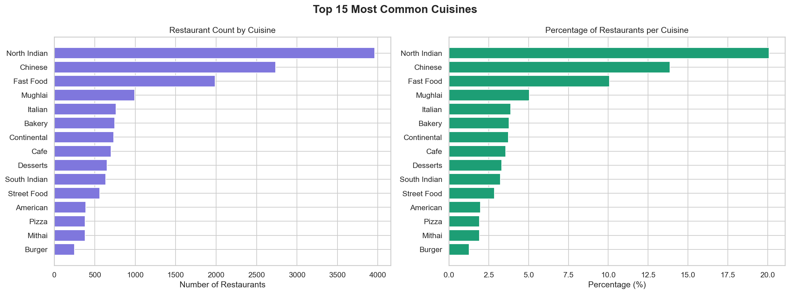
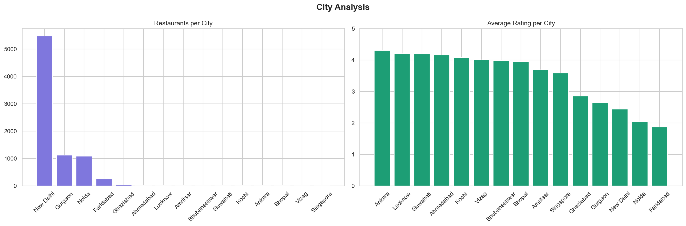
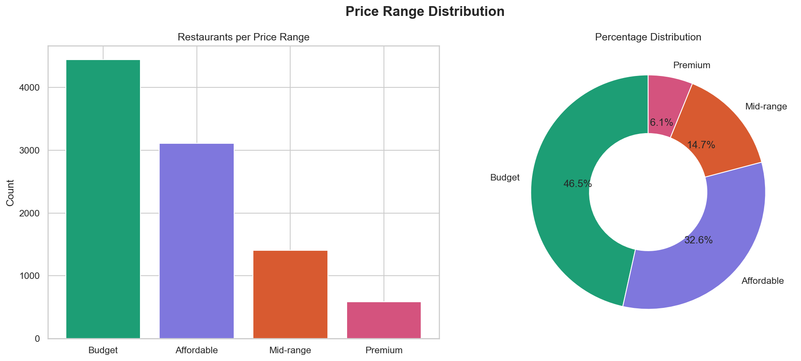
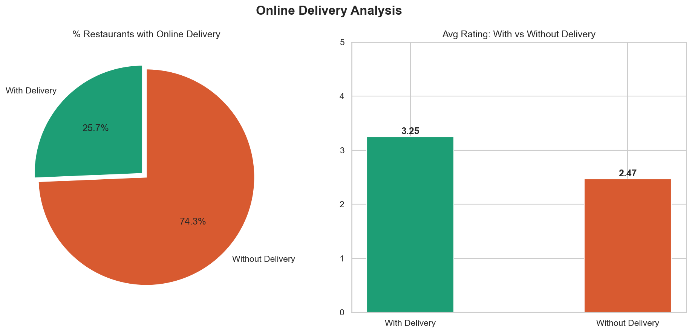
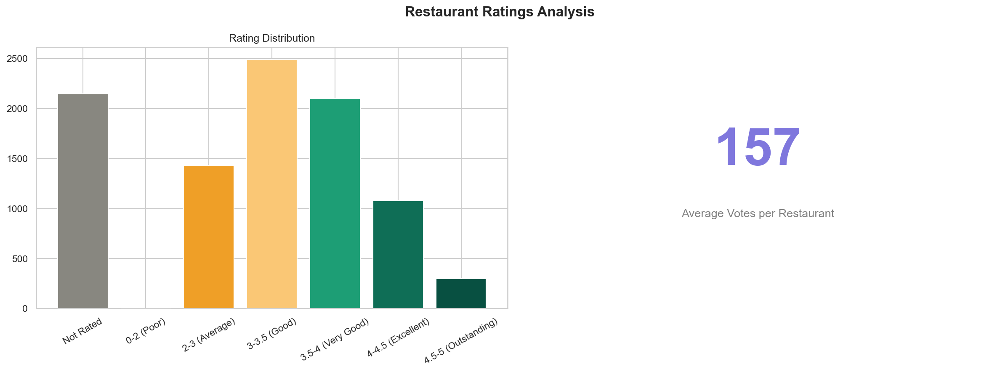
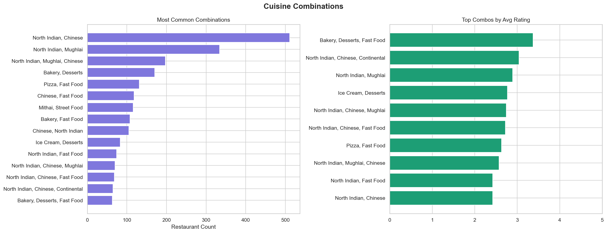
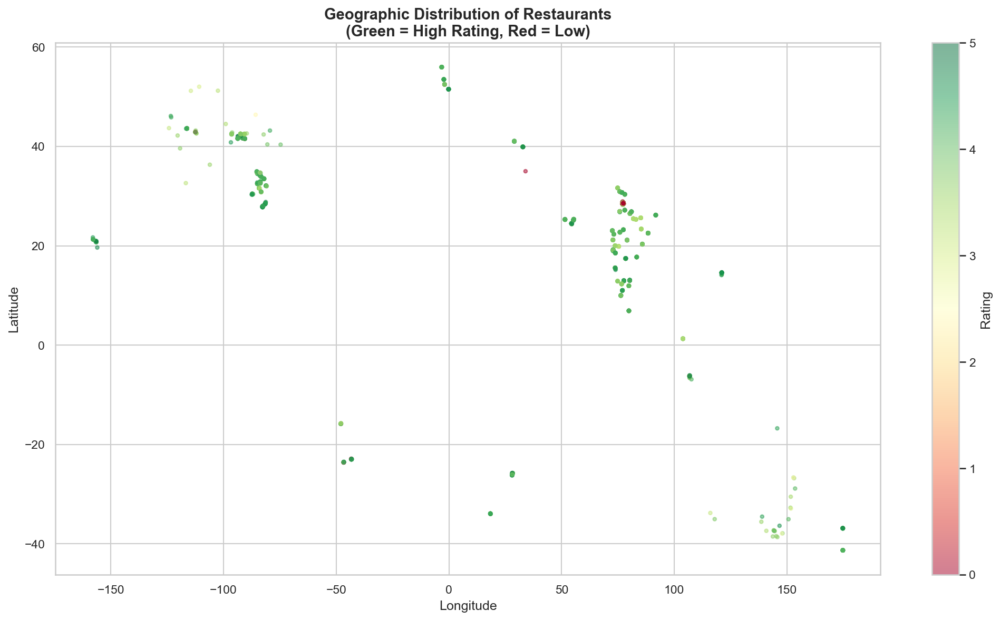
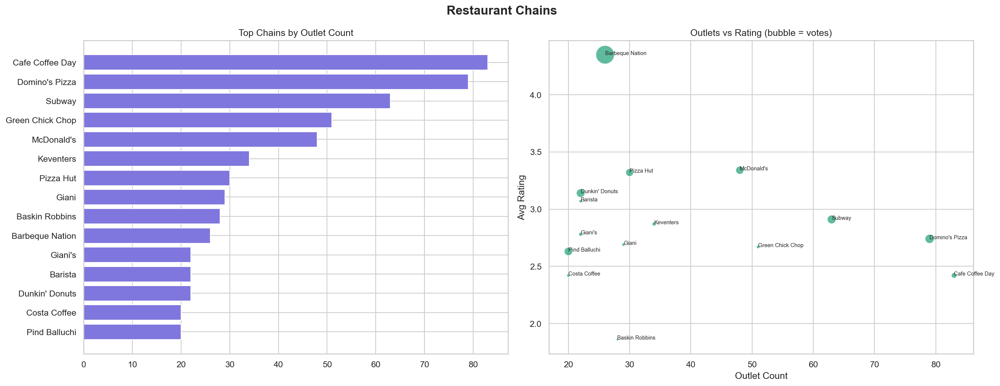
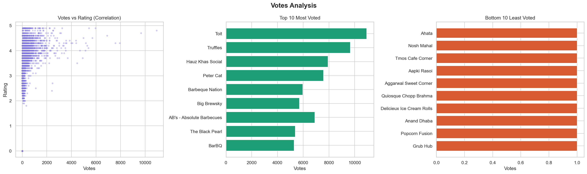
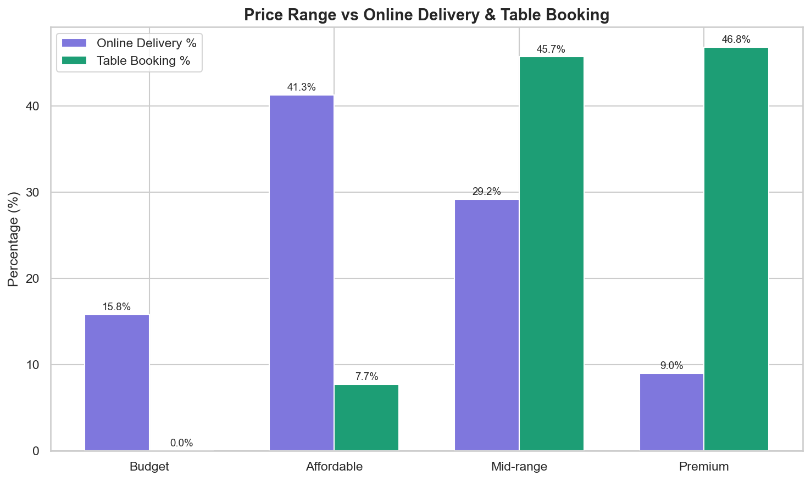

# 🍽️ Cognifyz Data Analysis Internship


---

## 📌 About the Project

This project is part of the **Cognifyz Technologies Data Analysis Internship Program**.  
The goal is to analyze a restaurant dataset with **9,500+ records** spanning multiple countries and cities, uncovering insights about cuisines, ratings, pricing, delivery trends, and geographic patterns.

---

## 🛠️ Tech Stack

| Tool | Purpose |
|------|---------|
| **PostgreSQL** | Database, SQL views, data modeling |
| **Python** | Data processing and visualization |
| **Pandas** | Data manipulation |
| **Matplotlib** | Chart generation |
| **Seaborn** | Statistical visualizations |
| **VS Code** | Development environment |

---

## 📁 Project Structure

```
cognifyz-data-analysis-Cyril/
├── SQL/
│   └── project.sql          ← All SQL views for every task
├── Python/
│   ├── level1.py            ← Level 1 analysis & charts
│   ├── level2.py            ← Level 2 analysis & charts
│   └── level3.py            ← Level 3 analysis & charts
├── solutions/
│   ├── L1_Task1_Cuisines.png
│   ├── L1_Task2_City.png
│   ├── L1_Task3_Price.png
│   ├── L1_Task4_Delivery.png
│   ├── L2_Task1_Ratings.png
│   ├── L2_Task2_Combos.png
│   ├── L2_Task3_Map.png
│   ├── L2_Task4_Chains.png
│   ├── L3_Task1_Votes.png
│   └── L3_Task2_PriceServices.png
└── Dataset_.csv             ← Source dataset
```

---

## 📊 Levels & Tasks

### ✅ Level 1 — Exploratory Analysis

**Task 1 — Top Cuisines**
- Determined the top 3 most common cuisines in the dataset
- Calculated the percentage of restaurants serving each cuisine

**Task 2 — City Analysis**
- Identified the city with the highest number of restaurants
- Calculated average rating per city
- Determined the city with the highest average rating

**Task 3 — Price Range Distribution**
- Visualized distribution of price ranges using bar and donut charts
- Calculated percentage of restaurants in each price category

**Task 4 — Online Delivery**
- Determined percentage of restaurants offering online delivery
- Compared average ratings of restaurants with and without delivery

---

### ✅ Level 2 — Intermediate Analysis

**Task 1 — Restaurant Ratings**
- Analyzed distribution of aggregate ratings
- Determined most common rating range
- Calculated average number of votes per restaurant

**Task 2 — Cuisine Combinations**
- Identified most common cuisine combinations
- Determined if certain combinations tend to have higher ratings

**Task 3 — Geographic Analysis**
- Plotted restaurant locations on a scatter map using longitude & latitude
- Identified geographic clusters and patterns

**Task 4 — Restaurant Chains**
- Identified restaurant chains (same name, multiple outlets)
- Analyzed ratings and popularity of top chains

---

### ✅ Level 3 — Advanced Analysis

**Task 1 — Votes Analysis**
- Identified restaurants with highest and lowest votes
- Analyzed correlation between number of votes and rating

**Task 2 — Price Range vs Services**
- Analyzed relationship between price range and online delivery/table booking availability
- Determined if higher-priced restaurants are more likely to offer these services

---

## 📸 Solutions

### Level 1
| Top Cuisines | City Analysis |
|---|---|
|  |  |

| Price Range | Online Delivery |
|---|---|
|  |  |

### Level 2
| Rating Distribution | Cuisine Combinations |
|---|---|
|  |  |

| Geographic Map | Restaurant Chains |
|---|---|
|  |  |

### Level 3
| Votes Analysis | Price vs Services |
|---|---|
|  |  |

---

## ⚙️ How to Run

**1. Clone the repository**
```bash
git clone https://github.com/cyriljaiswal/cognifyz-data-analysis-Cyril.git
cd cognifyz-data-analysis-Cyril
```

**2. Install required Python libraries**
```bash
pip install psycopg2-binary pandas matplotlib seaborn
```

**3. Set up PostgreSQL**
- Create database: `restaurant_db`
- Import `Dataset_.csv` into the `restaurant` table
- Run `SQL/project.sql` in pgAdmin to create all views

**4. Update DB password in Python files**
```python
conn = psycopg2.connect(
    host='localhost',
    database='restaurant_db',
    user='postgres',
    password='YOUR_PASSWORD',  # change this
    port=5432
)
```

**5. Run each level**
```bash
python Python/level1.py
python Python/level2.py
python Python/level3.py
```

---

## 🔍 Key Findings

- **North Indian** cuisine is the most common, appearing in over 30% of restaurants
- **New Delhi** has the highest number of restaurants in the dataset
- Most restaurants fall in the **Budget to Affordable** price range
- Restaurants **with online delivery** have slightly higher average ratings
- Strong **geographic clusters** found in South and Southeast Asia
- Higher-priced restaurants are **more likely** to offer table booking

---

## 👨‍💻 Author

**Richie (Cyril Jaiswal)**  
B.Tech CSE — MIT-ADT University, Pune  
GitHub: [@cyriljaiswal](https://github.com/cyriljaiswal)

---

## 🏢 Internship

**Cognifyz Technologies**  
[www.cognifyz.com](https://www.cognifyz.com) | contact@cognifyz.com  
LinkedIn: [@cognifyz-Technologies](https://linkedin.com/company/cognifyz-technologies)
